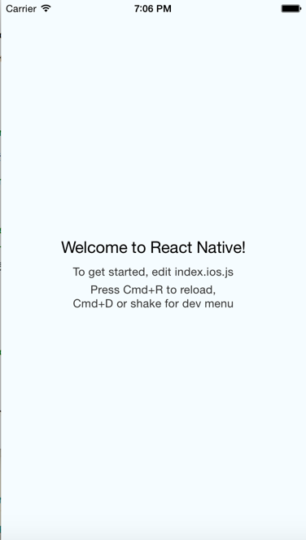
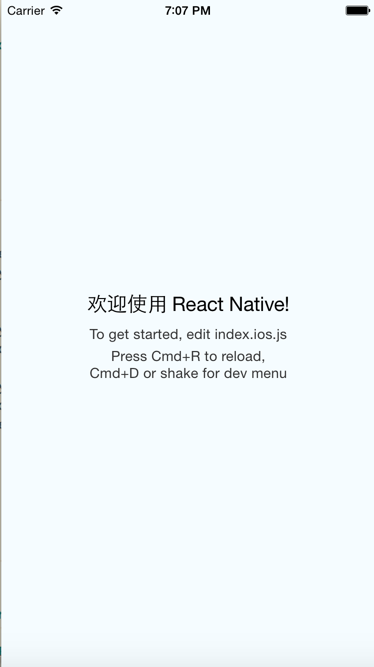
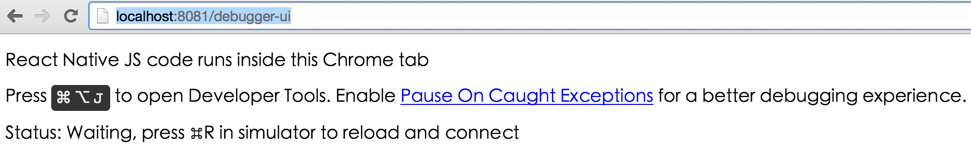
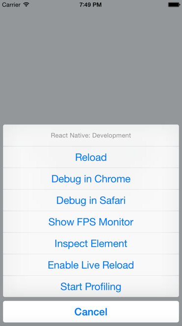
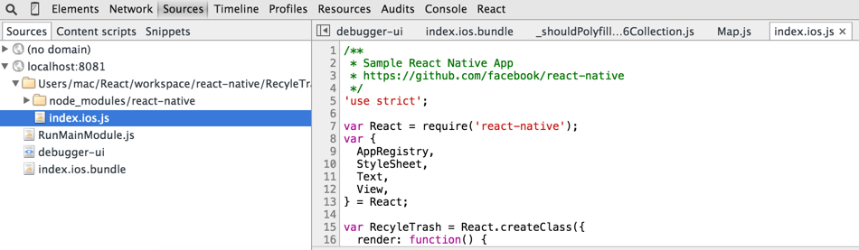
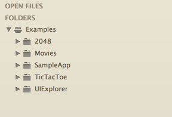
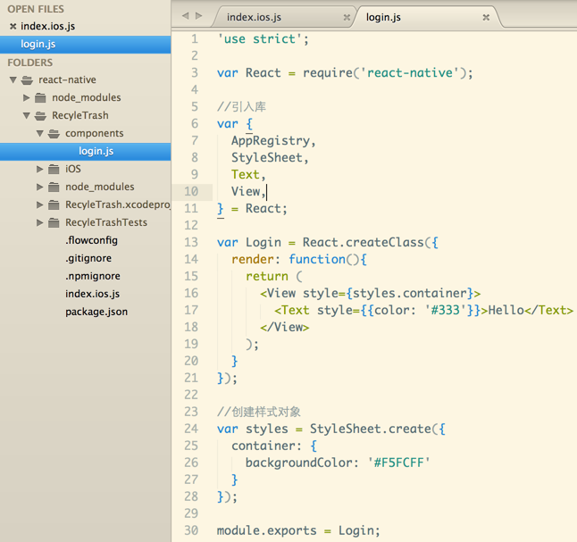

## 使用React Native构建iOS应用

- 本地Mobile应用

使用标准的工具针对特定的移动平台，如iOS构建应用，大幅提升用户体验。类似于用swift构建iOS应用, java构建android应用。

- React

React是facebook针对开发Web页面中View的一个JavaScript库（注意不是框架，更不是MVC框架）。它的中心主要集中在视图(View),不涉及应用如何架构，如果想了解如何架构应用，可以了解一下facebook 的Flux和Relay框架。React通过观察虚拟DOM(Virtual DOM),来实现根据需要来更新真实DOM，而不需要整体渲染真实DOM,这样的效率会更高一些。虚拟DOM允许在服务端生成，然后发送最终的HTML到浏览器端渲染，真样会解决SPA(Single Page Application) SEO问题。一般服务端可以使用Node,Clojure或者其他可以在服务端运行JavaScript引擎的语言环境。React带有自有JSX模版，允许在JavaScript混入HTML,作为组件一部分。因为React由facebook开源，facebook本身有许多内部项目都在使用，所以不用担心项目的支持问题。

- React Native

React Native使开发人员可以用JavaScript和React基于本地平台构建世界级的应用。

Github项目地址是: https://github.com/facebook/react-native

使用React Native可以很容易地构建与原生iOS应用相同用户体验的应用(只是目前性能方面还有待提升)，即使没有太深的Web开发经验也可以实现。React Native在不久的将来也会支持Android平台。

UI是基于100%本地iOS控件(UIKit)不会有违和感以及性能问题(表示怀疑)! 

使用熟悉的语言和库(JavaScript, React),不需要UIKit经验即可开发。

使用Web熟悉的工作流可以让你在模拟器(simulator)中直接刷新即可看到改动效果(如Grunt, Gulp, Webpack...).

当然调试可以使用chrome开发者工具来调试React代码，或者使用chrome的React插件调试。

使用类似CSS style语法修改View的展示。React Native会将样式转化为本地控件样式。

使用FlexBox布局React Native应用。

- React Native如何工作?

	  JSX -> JavaScript -> JavaScriptCore -> Objective-C
	  
### 安装React Native

访问http://facebook.github.io/react-native/docs/getting-started.html

1. 安装Xcode, Homebrew(http://brew.sh), iojs(watchman npm), flow

   去apple官网下载xcode IDE, 访问homebrew官网安装。安装完成后，安装iojs, 这里使用nvm(https://github.com/creationix/nvm)安装node和iojs，这样可以使用nvm切换不同的环境。
   
   
     	curl -o- https://raw.githubusercontent.com/creationix/nvm/v0.25.4/install.sh | bash   
     	
   也可以安装node
   
   		nvm install 5.0
   		
   切换iojs和node可以使用
   
   		nvm use default 5.0
   
   安装watchman
   
   		brew install watchman
   
   
2. 安装React Native

	因为react native建议使用node.
	
		sudo chown -R $USER ~/.npm
   
   		npm install -g react-native-cli

3. 生成React Native 项目

	通过cli命令生成项目
	
		 react-native init RecycleTrash
		
	如果出现一直停滞不前的话，查找日志
	
		find /Users/mac -name builderror.log
		
	可以打开类似这样的日志
	
		vim /Users/mac/xcode64/Xcode.app/Contents/Developer/usr/share/xcs/xcsd/node_modules/socket.io/node_modules/socket.io-client/node_modules/ws/builderror.log
		
	一般是因为node版本有问题，根据提示安装对应的node版本
	

4. 在iOS模拟器中启动应用

	安装成功后，根据控制台提示，打开xcode工程
	
		Open /Users/mac/React/workspace/react-native/RecyleTrash/RecyleTrash.xcodeproj
		
	点击Run
	
	
		
	如果需要修改内容，可以打开index.ios.js修改，然后command + r刷新模拟器即可看到修改后的内容。
	
	
	
5. 使用Chrome开发者工具调试

	运行项目，打开浏览器访问http://localhost:8081/debugger-ui,得到以下界面:
	
	
	
	command + d选择'Debug in Chrome'
	
	
	
	然后在source tab中debug
	
	
	
6. 运行Github上React Native项目的实例程序以及查看文档

   首先下载项目:
   
   		git clone git://github.com/facebook/react-native.git
   		cd react-native
   		cd Examples
   		subl .
   
   可以看到一些比较有意思的示例程序
   
   
   
   查看文档可以访问 http://facebook.github.io/react-native/docs/getting-started.html
   
###创建登陆画面

- 定义React组件

  在工程目录下创建一个目录components,定义一个login.js,然后在index.io.js中引用
  
  
  
  
		
- 引用自定义组件

 index.io.js修改为
  
  		var Login = require('./components/login.js');

		var RecyleTrash = React.createClass({
  			render: function() {
    			return <Login />
  			}
		});
		
- 引用React组件
  
   		//引入库
		var {
  			AppRegistry,
  			StyleSheet,
  			Text,
  			View,
  			Image,
  			TextInput,
  			TouchableHighlight
		} = React;
		
- 使用Image组件

  首先需要引入Image库， 注意source中的image是需要在xcode中Images.xcassets中添加的
  
  		//引入库
        var {
  			AppRegistry,
  			StyleSheet,
  			Text,
  			View,
  			Image
		} = React;

		var Login = React.createClass({
  		  render: function(){
  			return (
  				<View style={styles.container}>
  		  		  <Image style={styles.logo}
                       source={require('image!recycle_trash')}/>
  		          <Text style={{color: '#333'}}>Hello</Text>
  		       </View>
  			);
  		  }
		});

	  //创建样式对象
	  var styles = StyleSheet.create({
  	    container: {
    	  backgroundColor: '#F5FCFF',
    	  flex: 1,
    	  paddingTop: 100,
    	  alignItems: 'center'
  	    },
  	    logo: {
  		  width: 66,
  		  height: 66
  	    }
	  });
	  
  加上标题:
  
  		<View style={styles.container}>
  		  <Image style={styles.logo}
          source={require('image!recycle_trash')}/>
  		  <Text style={styles.heading}>
  		    TODO
  		  </Text>
  		</View>
  		
  		//...
  		heading: {
  	      fontSize: 20,
  	      marginTop: 10
        }

- 使用TextInput组件

  首相要引入TextInput,然后通过以下代码实现, secureTextEntry是针对安全输入，隐藏内容，类似于password 控件
  
  		<View style={styles.container}>
  		  <Image style={styles.logo}
          source={require('image!recycle_trash')}/>
  		  <Text style={styles.heading}>
  		    TODO List
  		  </Text>
  		  <TextInput style={styles.input}
  		       placeholder="用户手机号" />
  		  <TextInput style={styles.input}
  		       placeholder="密码" 
  		       secureTextEntry="true" />
  		</View>
  		
  	    //...
  	    
  	    input: {
  	      height: 40,
  	      marginTop: 10,
  	      padding: 4,
  	      fontSize: 14,
  	      borderWidth: 1,
  	      borderColor: '#48bbec'
        }

- 使用TouchableHighlight组件

		<TouchableHighlight style={styles.button}>
  		    <Text style={styles.buttonText}>登 录</Text>
  		</TouchableHighlight>
  		
  		//...
  		
  		button: {
    		height: 40,
    		backgroundColor: '#48bbec',
    		alignSelf: 'stretch',
    		marginTop: 10,
    		justifyContent: 'center'
  		},
  		buttonText: {
    		fontSize: 18,
    		color: '#fff',
    		alignSelf: 'center'
  		}
 - 使用ES6重构Login组件
 
   login组件需要继承Component,所以要引入Component组件
   
   		//引入库
		var {
		  AppRegistry,
		  StyleSheet,
		  Text,
		  View,
		  Image,
		  TextInput,
		  TouchableHighlight,
		  Component
		} = React;
		
		class Login extends Component {
  		  constructor(props) {
		    super(props);
		  }

		  render(){
		  	return (
  				<View style={styles.container}>
		  		  <Image style={styles.logo}
        			    source={require('image!recycle_trash')}/>
		  		  <Text style={styles.heading}>
  				    TODO List
		  		  </Text>
		  		  <TextInput style={styles.input}
  				       placeholder="用户手机号" />
		  		  <TextInput style={styles.input}
  				       placeholder="密码" 
	  		       secureTextEntry="true" />
  				  <TouchableHighlight style={styles.button}>
		  		    <Text style={styles.buttonText}>登 录</Text>
		  		  </TouchableHighlight>
  				</View>
		  	);
		  }
		};
		
  捕捉登录操作，并显示进度条
  
  		//引入库
		var {
		  AppRegistry,
		  StyleSheet,
		  Text,
		  View,
		  Image,
		  TextInput,
  		  TouchableHighlight,
		  Component,
		  ActivityIndicatorIOS
		} = React;
		
		<TouchableHighlight style={styles.button} onPress={this.login.bind(this)}>
  		    <Text style={styles.buttonText}>登 录</Text>
  		</TouchableHighlight>
		
		<ActivityIndicatorIOS
          animating={this.state.showProgress}
          size='large'
          style={this.styles.loader}
        />
        
        login() {
    		console.log('mobile',this.state.mobile)
    		this.setState({showProgress: true})
 		 }

 - 认证
 	
 	使用HTTP请求获取信息
 		
 		fetch('http://localhost:3000/api/v1/sessions')
    	.then((res) => {
      		return res.json();
   		})
    	.then((result) => {
      		console.log(result);
      		this.setState({showProgress: false})
    	});
    	
 - 针对md5编码安装库
 
 	
 - 根据登录状态，显示不同的页面
 	
 	
 - 使用AsyncStorage存储和获取认证信息
 
   如果登录成功，关闭应用，下次再次打开时，不需要再登录
   
   		AsyncStorage.setItem()
   		AsyncStorage.multiSet()
   		

###使用Tab组件

- 设置Tab文本

		<TabBarIOS>
		  <TabBarIOS.Item />
		  <TabBarIOS.Item />
		</TabBarIOS>
				

- 设置Tab选择状态
- 设置Tab icon
- 捕捉Tab onPress事件

###使用ListView组件

- 使用ListView
- ListView获取数据
- 为ListView绑定数据
- 加载时显示进度
- 针对rows布局

###使用Navigator组件

- 使用TouchableHighlight组件使rows可以触控
- 为row添加onPress事件回调
- 使用NavigatorIOS组件跳转到详细页面
- 通过props传递数据到详细页面

###添加search

- 添加组件包含search表单
- 在IOSNavigator组件中显示Search
- 定义一个组件显示搜索结果
- 过渡到搜索结果页面
- 调用API获取搜索结果
- 

   		

   		
   	
